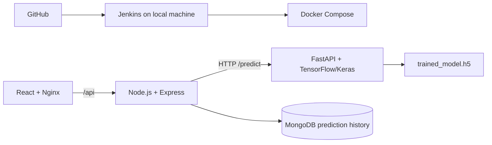

# NeuroScan — Brain MRI Classification

NeuroScan is a local, containerized research application that classifies an
uploaded brain MRI into Glioma, Meningioma, No Tumor, or Pituitary. It is not a
medical device and must not be used as a substitute for clinical assessment.

## Architecture



The request flow is: **React → Node/Express → FastAPI → TensorFlow model →
Node/Express → MongoDB → React**. The browser never calls the ML service
directly. Nginx proxies `/api` to the Node service, which avoids production
browser CORS issues.

## Stack

- React + Vite, built and served by Nginx
- Node.js + Express + Mongoose
- Python FastAPI + TensorFlow/Keras
- MongoDB 7
- Docker Compose for local orchestration
- Jenkins for local CI/CD

## Repository layout

```text
client/              React UI and Nginx production proxy
server/              Express API and MongoDB model
ml-service/          FastAPI inference service and trained CNN
ml-service/notebooks/ optional CNN training notebook
tests/e2e.mjs        end-to-end deployment verification
docker-compose.yml   four-service local deployment
Jenkinsfile          local CI/CD pipeline
```

## Prerequisites

- Docker Desktop with Docker Compose v2
- Git and Git LFS (required for `trained_model.h5`)
- Node.js 20+ only for the host-side E2E test/Jenkins agent
- Jenkins on the same local machine or another machine that can access this
  Docker engine

## Run with Docker

```powershell
git lfs install
docker compose up --build -d
docker compose ps
```

Open [http://localhost](http://localhost). To stop the local stack without
deleting prediction history:

```powershell
docker compose down
```

Use `docker compose down -v` only when you intentionally want to delete the
local MongoDB volume and all saved prediction history.

## Environment configuration

Docker Compose supplies internal service URLs. Do not put secrets in source
control. For local non-Docker development, copy the example files first.

| Service | Variable | Example |
|---|---|---|
| server | `PORT` | `5000` |
| server | `ML_SERVICE_URL` | `http://localhost:8000` |
| server | `MONGO_URI` | `mongodb://localhost:27017/neuroscan` |
| server | `CORS_ORIGIN` | `http://localhost:5173` |
| client | `VITE_API_URL` | `http://localhost:5000` for Vite development |

## API endpoints

| Method | Path | Purpose |
|---|---|---|
| GET | `/api/health` | Node, MongoDB, and ML connectivity state |
| POST | `/api/predict` | Upload image field `image` for a classification |
| GET | `/api/history` | Ten most recent saved predictions |
| GET | `http://localhost:8000/health` | ML service model-load state |

`/api/predict` returns the model’s real softmax output:

```json
{
  "prediction": "Glioma",
  "confidence": 0.87,
  "probabilities": {
    "Glioma": 0.87,
    "Meningioma": 0.05,
    "No Tumor": 0.03,
    "Pituitary": 0.05
  }
}
```

## Local development

Start MongoDB first (for example, `docker compose up mongo -d`), then use the
environment examples in `server/.env.example` and `client/.env.example`.

```powershell
# ML service
cd ml-service
pip install -r requirements.txt
uvicorn app:app --reload --port 8000

# Express API, separate terminal
cd server
npm install
npm run dev

# React UI, separate terminal
cd client
npm install
npm run dev
```

The deployed model is `ml-service/trained_model.h5`. FastAPI resolves it
relative to `app.py`, loads it once at startup, validates uploads, applies the
model’s 224×224 RGB + Gaussian blur + normalization preprocessing, and returns
the true model probabilities. Optional retraining is documented in
`ml-service/notebooks/cnn_training.ipynb`; it is separate from inference.

## Tests and verification

After `docker compose up --build -d`, run:

```powershell
node tests/e2e.mjs
```

This verifies the frontend, Nginx API proxy, FastAPI health/model loading,
Node-to-ML communication, MongoDB connectivity/history, valid image upload,
actual probabilities, and invalid-upload rejection.

## Jenkins local CI/CD

Create a Pipeline (or Multibranch Pipeline) in Jenkins pointing at this GitHub
repository. The Jenkins agent must have Docker Compose and Node.js 20+.
`Jenkinsfile` runs entirely locally:

1. Checkout from GitHub.
2. Validate `docker compose` configuration.
3. Build frontend, backend, and ML images.
4. Safely stop the prior local stack and start the updated one.
5. Run `tests/e2e.mjs`.
6. Print service state, and logs on failure.

No AWS service, registry credential, database password, or GitHub token is
hardcoded in the project. Configure Jenkins source-control credentials in the
Jenkins credential store if the repository is private.

## Troubleshooting

- `docker compose ps` shows each service and health state.
- `docker compose logs -f ml-service` diagnoses model-loading issues.
- `docker compose logs -f server` diagnoses FastAPI or MongoDB errors.
- If port 80, 5000, 8000, or 27017 is already occupied, stop the conflicting
  local application or change the host-side port mapping in `docker-compose.yml`.
- Run `git lfs pull` after cloning if `trained_model.h5` is only an LFS pointer.

## Limitations and medical disclaimer

The current recovered CNN was evaluated on its available held-out dataset at
approximately 76.4% accuracy; it has not met a 95% validation target. Outputs
are research/educational model predictions, not diagnoses. Do not use this
application to make medical decisions; seek a qualified healthcare
professional.
